# 5stages-FlowingThrough-CPU-using-RISCV
基于RISC-V指令集的五段流水CPU设计。已实现R-type，I-type类指令和分支，跳转，直接寻址与简介寻址等功能，自带简单的2bit深度分支预测

## 顶层结构框图

```mermaid
flowchart TB
    subgraph CPU["CPU 顶层模块"]
        
        subgraph IF["IF 阶段 (取指)"]
            PC_BTB["PC_BTB<br/>(PC和BTB)"]
            ROM["ROM<br/>(指令存储器)"]
            
            PC_BTB -->|PC, PC_add4| ROM
        end
        
        subgraph IF_ID["IF-ID 流水线寄存器"]
            IF_ID_regs["IF_ID_regs<br/>(时钟上升沿锁存)"]
        end
        
        subgraph ID["ID 阶段 (译码)"]
            IDU["InstructionDecoder<br/>(指令译码器)"]
            RF["RegisterFile<br/>(寄存器文件)"]
            predicPCsub4["SUBB4<br/>(PC预测计算)"]
            
            IDU -->|rs1, rs2| RF
            predicPCsub4 -->|PC_predict| JCU
        end
        
        subgraph ID_EX["ID-EX 流水线寄存器"]
            ID_EX_regs["ID_EX_regs<br/>(时钟上升沿锁存)"]
        end
        
        subgraph EX["EX 阶段 (执行)"]
            rs1_data_MUX["rs1_data_MUX<br/>(数据前传选择)"]
            rs2_data_MUX["rs2_data_MUX<br/>(数据前传选择)"]
            A_select["A_select MUX<br/>(操作数A选择)"]
            B_select["B_select MUX<br/>(操作数B选择)"]
            ALU["ALU<br/>(算术逻辑单元)"]
            JCU["JumpCtrlUnion<br/>(跳转控制单元)"]
            PC_sub4["SUBB4<br/>(PC减4)"]
            jumpPCsub4["SUBB4<br/>(跳转PC计算)"]
            
            rs1_data_MUX -->|EX_rs1_update_data| A_select
            rs2_data_MUX -->|EX_rs2_update_data| B_select
            A_select -->|EX_ALU_data_A| ALU
            B_select -->|EX_ALU_data_B| ALU
            ALU -->|EX_Result, EX_Zero| JCU
            PC_sub4 -->|EX_PC| A_select
            jumpPCsub4 -->|jump_PC| PC_BTB
        end
        
        subgraph EX_MEM["EX-MEM 流水线寄存器"]
            EX_MEM_regs["EX_MEM_regs<br/>(时钟上升沿锁存)"]
        end
        
        subgraph MEM["MEM 阶段 (访存)"]
            RAM["RAM<br/>(数据存储器)"]
        end
        
        subgraph MEM_WB["MEM-WB 流水线寄存器"]
            MEM_WB_regs["MEM_WB_regs<br/>(时钟上升沿锁存)"]
        end
        
        subgraph WB["WB 阶段 (写回)"]
            WBCL["WritebackControlLogic<br/>(写回控制逻辑)"]
        end
        
        subgraph GlobalCtrl["全局控制单元"]
            FCU["ForwardingCtrlUnion<br/>(数据前传控制单元)"]
            BHT["BHT<br/>(分支历史表)"]
        end
        
        %% 流水线数据流连接
        IF -->|IF_instruction, IF_PC_add4| IF_ID
        IF_ID -->|ID_instruction, ID_PC_add4| ID
        ID -->|ID数据和控制信号| ID_EX
        ID_EX -->|EX数据和控制信号| EX
        EX -->|EX结果和控制信号| EX_MEM
        EX_MEM -->|MEM数据和控制信号| MEM
        MEM -->|MEM数据和结果| MEM_WB
        MEM_WB -->|WB数据| WB
        
        %% 反馈控制路径
        WB -->|we, waddr, wdata| RF
        EX -->|jump, is_JBtype, clean, PC_update, jump_dist| IF
        
        %% 数据前传路径
        EX -->|EX_instruction| FCU
        EX_MEM -->|MEM_instruction, MEM_Result| FCU
        MEM_WB -->|WB_instruction, WB_Result| FCU
        MEM -->|MEM_LOAD_data| FCU
        FCU -->|data1_update, data2_update,<br/>rs1_update_data, rs2_update_data, Bubble| EX
        
        %% BHT连接
        EX -->|is_JBtype, jump| BHT
        BHT -->|serch_en| PC_BTB
        
        %% 全局控制信号标注
        PC_BTB -.->|Bubble, PC_update, serch_en,<br/>jump_PC, jump_dist| IF
        JCU -.->|jump, is_JBtype, PC_update,<br/>clean, jump_dist| PC_BTB
        
    end
    
    %% 外部接口
    clk["clk (时钟)"] --> CPU
    rst_n["rst_n (复位)"] --> CPU
    
    %% 样式定义
    classDef stage fill:#e1f5fe,stroke:#01579b,stroke-width:2px
    classDef regs fill:#fff3e0,stroke:#e65100,stroke-width:2px
    classDef control fill:#f3e5f5,stroke:#4a148c,stroke-width:2px
    classDef mem fill:#e8f5e8,stroke:#1b5e20,stroke-width:2px
    
    class IF,ID,EX,MEM,WB stage
    class IF_ID,ID_EX,EX_MEM,MEM_WB regs
    class GlobalCtrl control
    class ROM,RAM mem
```

### 结构图说明
#### 1. 五级流水线结构
IF阶段：PC_BTB生成PC地址，ROM读取指令

ID阶段：指令译码、寄存器读取、PC预测计算

EX阶段：数据前传、操作数选择、ALU运算、跳转控制

MEM阶段：数据存储器读写

WB阶段：写回数据选择和控制

#### 2. 流水线寄存器
每个阶段之间通过D触发器组隔离（IF-ID、ID-EX、EX-MEM、MEM-WB）

确保时序正确，避免数据冲突

#### 3. 关键控制路径
数据前传：通过FCU检测数据冒险，将EX/MEM/WB阶段的结果前传到EX阶段

跳转控制：JCU生成跳转信号，反馈到IF阶段修改PC

分支预测：BHT提供分支预测信息，配合BTB优化取指

#### 4. 全局控制信号
Bubble：流水线暂停

clean：指令冲刷

we/waddr/wdata：寄存器写回控制

data1_update/data2_update：数据前传使能
